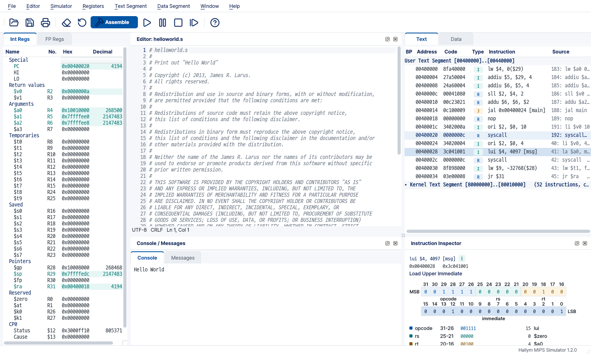

# Hallym MIPS Simulator

An educational GUI extension of [SPIM / QtSpim](https://spimsimulator.sourceforge.net/) 9.1.24,
the MIPS32 simulator by James R. Larus, for the computer architecture courses
of Hallym University. The simulator core (`CPU/`) is
**unmodified**: programs assemble and run exactly as they do in standard
QtSpim, and the test suite checks that on every push. Only the interface is
new, and in this edition it carries the university's identity: its colours,
fonts and marks (`docs/design/tokens.md`).

## What's different

Both programs below were given the same file (`helloworld.s`), the same steps,
the same 1600×900 window and the same environment. **The simulation is
identical; only what you see changes.**

**Registers** — after *Run*. Grouped by role, `$name` and number together, hex
and decimal side by side, and everything the run changed in bold teal; upstream is
one flat list in one base at a time.


**Text** — columns instead of a text dump: a breakpoint column, the machine
word, a type badge (R / I / J …), the instruction, the source line. The kernel
segment is one folded row until you want it.


**Instruction Inspector** — select an instruction and the panel under Text
spreads its word over thirty-two boxes, one per bit, MSB on the left and LSB
on the right, each field in its own colour, with a line per field giving its
bit range, its bits, its value and what that value means -- and, for a branch
or a jump, the sum that produced its destination. Upstream shows the word as
hex and nothing more.


**Data and stack** — a table with headers, the labels of `.data`, a marker on
the word `$sp` points to, words / halves / bytes. The strings at the top of the
stack (environment variables and paths, i.e. your user name) are folded away
instead of being the first thing in every screenshot.


**Editor** — write, press Ctrl+S to save *and* assemble, get the errors as a
list with markers on their lines. Standard QtSpim has no editor.

**Console and Messages** — what your program prints and what the simulator
says are two tabs of one panel along the bottom, not a second window to lose
behind the first. A syscall that waits for input brings the Console tab
forward and gives it the keyboard; an error brings Messages forward.


**A tutorial on the first run** — seven steps over the real window, one panel at a
time, in Korean or English; Help > Tutorial brings it back.

Also: File > Load File asks before loading on top of a loaded program, a
status-bar badge shows while Bare Machine or a similar setting is on, and the
program installs and runs next to standard QtSpim without touching it.

<details><summary>The whole window</summary>



</details>

## Download

**[Latest release](https://github.com/ars2323/hallym-mips-simulator/releases/latest)** (Windows 64-bit):

- `HallymMIPS-<version>-win64.zip` — recommended. Unzip, run `HallymMIPS.exe`. No administrator rights needed.
- `HallymMIPS-<version>-win64.msi` — installer (Program Files, Start menu).
- User guide: [한국어](docs/GUIDE-ko.md) · [English](docs/GUIDE.md) (PDFs on the release page)

The program is not code-signed; on the SmartScreen prompt choose *More info → Run anyway*.

## Building

Qt 5.15, bison and flex are needed (Linux: g++; Windows: MSVC 2019 with
winflexbison). Always build out of the source tree:

```sh
mkdir -p build && cd build && qmake ../QtSpim/QtSpim.pro && make -j"$(nproc)"
```

Tests: `tests/tests.pro` (unit tests, including an oracle that checks the
instruction decoder and the file loader against the real SPIM core),
`tools/regress.sh` (output against vanilla 9.1.24, saved logs byte for byte),
`tools/check-menu-load.sh --compare-vanilla`, `tools/check-editor.sh`.
`docs/ARCHITECTURE.md` (in Korean) describes the code and lists everything that
intentionally differs from upstream; `docs/FUTURE.md` lists what is not done.
`docs/design/tokens.md` is the design system (colours from the university's
UI manual, fonts, spacing); `QtSpim/edu/theme/` implements it.

## License

SPIM is Copyright (c) 1990-2023 James R. Larus and is distributed under a BSD
license; the full text is in [`README`](README), which is upstream's file and
is kept as it is. The changes in this repository are offered under the same
terms. The program links to the Qt library, which is distributed under the GNU
Lesser General Public License version 3 and version 2.1.

Developed by Hakhyeon Kim, AIAC Lab, Hallym University.

The bundled fonts Pretendard and D2Coding are under the SIL Open Font License
1.1 and the Lucide icons under the ISC license (Help > About > License).

The university symbol, logotype, emblem and signature belong to Hallym
University. They are used whole, scaled and spaced only, never redrawn or
recoloured, under the university's UI regulations: the identity is made for
promoting the university and may not be used commercially. Questions about it
go to the Communications Team (033-248-1333, de1330@hallym.ac.kr). The source
files and the regulations as published are kept in
[`assets/ci/`](assets/ci/).

This is a modified version of QtSpim (through [QtSpim-Edu](https://github.com/ars2323/qtspim-edu),
whose history this repository continues) and is not endorsed by the original author.
