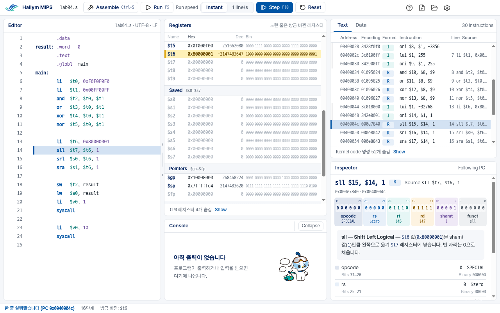

# Hallym MIPS Simulator

> **사용법 (한국어): [docs/usage/usage.ko.md](docs/usage/usage.ko.md)** — 내려받기, 설치,
> Windows 경고 창 넘기기, 첫 실행과 튜토리얼, 화면 설명, 자주 막히는 곳.
>
> User guide (English): [docs/usage/usage.en.md](docs/usage/usage.en.md)

A MIPS simulator for the computer architecture courses of Hallym University,
built on [SPIM](https://spimsimulator.sourceforge.net/) by James R. Larus.
Students write MIPS assembly, assemble it, and run it one line at a time,
watching registers, memory and each instruction's 32 bits change.

**Version 2.x — the Electron edition, in [`electron/`](electron/) — is the
current version.** Version 1.x — the Qt edition, a modified QtSpim, at the
root of this repository — is the previous one. It is still maintained as a
fallback and can still be downloaded:
[release 1.2.4](https://github.com/ars2323/hallym-mips-simulator/releases/tag/v1.2.4).

Both editions run the same, unmodified SPIM core ([`CPU/`](CPU/)): a program
assembles and runs exactly as it does in standard SPIM.



## Download

**[Latest release](https://github.com/ars2323/hallym-mips-simulator/releases/latest)** (Windows 64-bit):

- `HallymMIPS-<version>-win-x64-setup.exe` — the installer. Installs for the
  current user only (no administrator rights), adds a Start menu entry.
- `HallymMIPS-<version>-win-x64.zip` — no installation: unzip, run `HallymMIPS.exe`.

The program is not code-signed, so Windows SmartScreen warns the first time it
runs. Choose **More info → Run anyway**; the user guide
([한국어](docs/usage/usage.ko.md#windows-경고-창-넘기기) ·
[English](docs/usage/usage.en.md#getting-past-the-windows-warning)) shows the
steps. Version 2.x installs beside 1.x without touching it.

## Repository layout

```text
CPU/            the SPIM core (SPIM/QtSpim 9.1.24), unmodified, shared by both editions (CPU/ORIGIN.md)
electron/       the Electron edition (2.x): electron/docs/DEVELOPMENT.md
QtSpim/         the Qt edition (1.x): QtSpim's interface, modified
tests/ tools/   the Qt edition's tests and tools
Tests/ ...      SPIM's own files, as upstream has them (README, ChangeLog, Documentation/, spim/, xspim/, PCSpim/)
docs/           the user guide (docs/usage/) and the Qt edition's documents
LICENSE NOTICE  this project's license; third-party components and the university's marks
```

The Qt edition stays at the root, where 1.2.4 was built from, so that its
build paths do not move: if 2.x has to be pulled back from the labs, 1.x can be
rebuilt and released exactly as before.

## Building

### Electron edition (2.x)

Node 22.18 or later, a C++ compiler, make, python3, bison and flex (on
Windows: MSVC and winflexbison). From `electron/`:

```sh
cd electron
npm install --ignore-scripts
npm run build            # the SPIM addon (native/build/Release/spim.node)
npm test                 # unit and golden tests
npm run build:electron   # the addon against Electron's headers
npm run electron         # start the app
npm run e2e              # the real app, through Playwright (needs a display; xvfb-run on Linux)
npm run package          # installer and zip in electron/dist/ (on Windows)
```

More in [`electron/docs/DEVELOPMENT.md`](electron/docs/DEVELOPMENT.md);
how it differs from the Qt edition, and why, in
[`electron/docs/PORTING.md`](electron/docs/PORTING.md).

### Qt edition (1.x)

Qt 5.15, bison and flex (Linux: g++; Windows: MSVC 2019 with winflexbison).
Always build out of the source tree:

```sh
mkdir -p build && cd build && qmake ../QtSpim/QtSpim.pro && make -j"$(nproc)"
```

Tests: `tests/tests.pro` (unit tests, including an oracle that checks the
instruction decoder and the file loader against the real SPIM core),
`tools/regress.sh` (output against vanilla 9.1.24, saved logs byte for byte),
`tools/check-menu-load.sh --compare-vanilla`, `tools/check-editor.sh`.
`docs/ARCHITECTURE.md` describes the code; `docs/GUIDE.md` and
`docs/GUIDE-ko.md` are the 1.x user guide.

### Continuous integration

Two workflows, one per edition: **Qt edition (1.x)** (`ci.yml`, Linux and
Windows) and **Electron edition (2.x) — Windows** (`electron.yml`). A change
under `electron/` runs only the second, a change elsewhere only the first, and
a change to `CPU/` runs both.

## License

This project is under the BSD 3-Clause License ([`LICENSE`](LICENSE)).
It is built on SPIM, Copyright (c) 1990-2023 James R. Larus, also under a BSD
license; SPIM's own README is kept at the root as [`README`](README).
[`NOTICE`](NOTICE) lists every third-party component and which edition it
applies to: SPIM and QtSpim (both), Qt under the LGPL v3 (the Qt edition only),
Electron, Chromium and Node.js (the Electron edition only), the fonts
Pretendard and D2Coding (SIL OFL 1.1) and the Lucide icons (ISC).

The Hallym University marks and the characters Haram and Hari belong to
Hallym University. They are not covered by this project's license and may not
be taken from here and used elsewhere (see [`NOTICE`](NOTICE)).

Developed by Hakhyeon Kim, AIAC Lab, Hallym University, as a personal
project. This is not an official product of Hallym University, and it is not
endorsed by the original author of SPIM.
