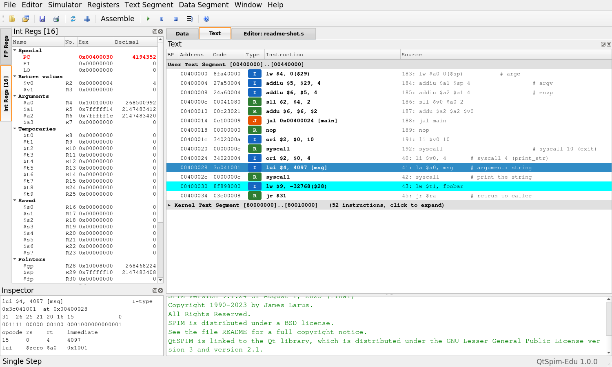

# QtSpim-Edu

An educational GUI extension of [SPIM / QtSpim](https://spimsimulator.sourceforge.net/) 9.1.24,
the MIPS32 simulator by James R. Larus. The simulator core (`CPU/`) is
**unmodified**: programs assemble and run exactly as they do in standard
QtSpim, and the test suite checks that on every push. Only the interface is
new.



- **Registers** grouped by their role, hex and decimal side by side, changes highlighted
- **Text**: every instruction with its type (R / I / J …); select one to see its opcode, rs, rt, rd, shamt, funct and immediate fields and where a branch goes
- **Data / stack**: labels, markers where `$sp` `$fp` `$gp` point, words / halves / bytes; the environment strings at the top of the stack are folded away
- **Editor**: write, press Ctrl+S to save *and* assemble, errors in a list instead of one dialog each
- Installs and runs next to standard QtSpim without touching it

## Download

**[Latest release](https://github.com/ars2323/qtspim-edu/releases/latest)** (Windows 64-bit):

- `QtSpimEdu-<version>-win64.zip` — recommended. Unzip, run `QtSpimEdu.exe`. No administrator rights needed.
- `QtSpimEdu-<version>-win64.msi` — installer (Program Files, Start menu).
- User guide: [한국어](docs/GUIDE-ko.md) · [English](docs/GUIDE.md) (PDFs on the release page)

The program is not code-signed; on the SmartScreen prompt choose *More info → Run anyway*.

## Building

Qt 5.15, bison and flex are needed (Linux: g++; Windows: MSVC 2019 with
winflexbison). Always build out of the source tree:

```sh
mkdir -p build && cd build && qmake ../QtSpim/QtSpim.pro && make -j"$(nproc)"
```

Tests: `tests/tests.pro` (unit tests, including an oracle that checks the
instruction decoder and the file loader against the real SPIM core),
`tools/regress.sh` (output against vanilla 9.1.24, saved logs byte for byte),
`tools/check-menu-load.sh --compare-vanilla`, `tools/check-editor.sh`.
`docs/ARCHITECTURE.md` (in Korean) describes the code and lists everything that
intentionally differs from upstream; `docs/FUTURE.md` lists what is not done.

## License

SPIM is Copyright (c) 1990-2023 James R. Larus and is distributed under a BSD
license; the full text is in [`README`](README), which is upstream's file and
is kept as it is. The changes in this repository are offered under the same
terms. The program links to the Qt library, which is distributed under the GNU
Lesser General Public License version 3 and version 2.1.

This is a modified version and is not endorsed by the original author.
