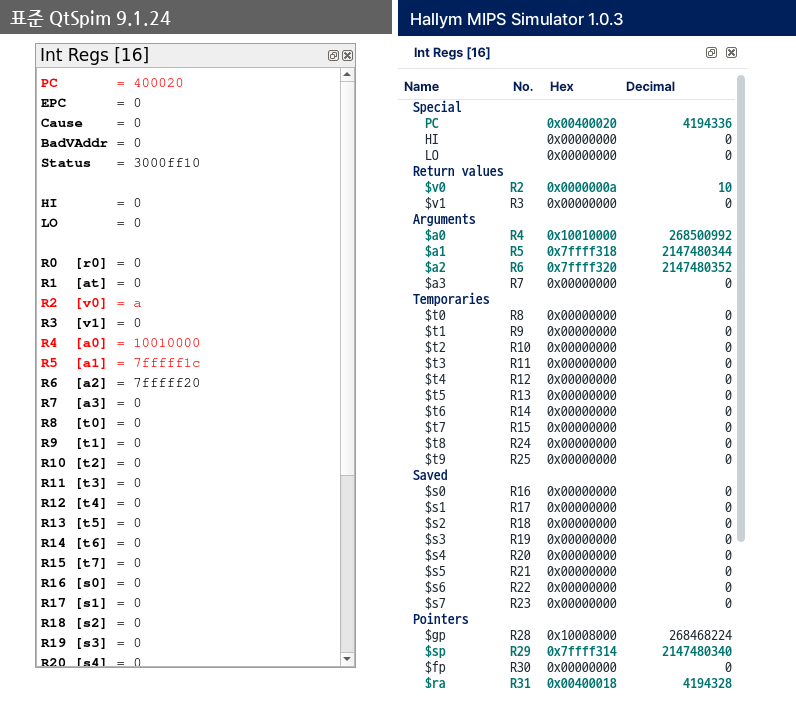
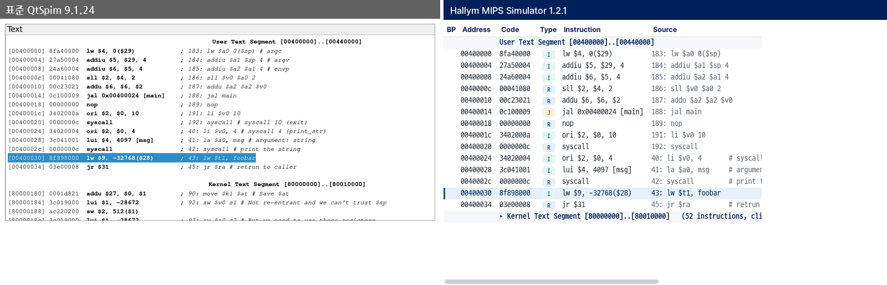
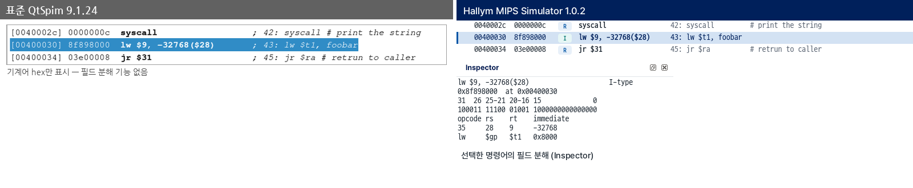
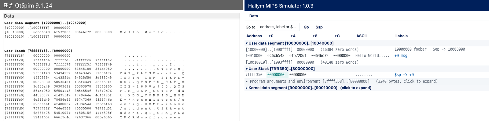
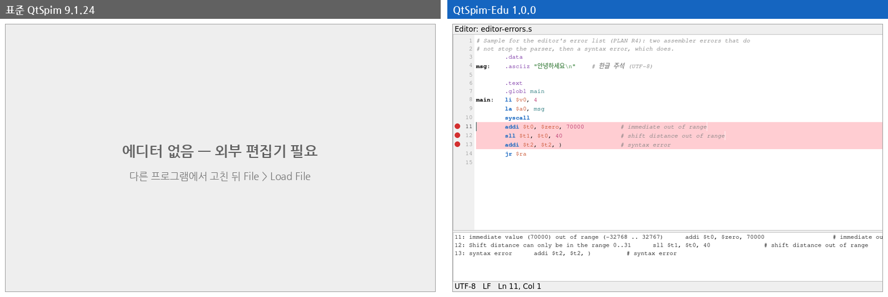

# 한림 MIPS 시뮬레이터 1.0.1 사용 안내

한림 MIPS 시뮬레이터(Hallym MIPS Simulator)는 MIPS 시뮬레이터 **QtSpim 9.1.24의 화면만 바꾼** 한림대학교 수업용 프로그램입니다.
시뮬레이터 본체(어셈블러와 실행기)는 원본 그대로여서, **같은 프로그램은 표준 QtSpim과 똑같이 어셈블되고 똑같은 결과를 냅니다.** 과제는 어느 쪽에서 확인해도 됩니다.

## 1. 설치

1. `HallymMIPS-<버전>-win64.zip`을 원하는 곳에 풉니다. 압축을 풀면 폴더가 하나 생깁니다. (MSI 설치 파일도 있지만 zip을 권장합니다. 관리자 권한이 필요 없고, 지울 때는 폴더만 지우면 됩니다.)
2. 그 폴더 안의 `HallymMIPS.exe`를 실행합니다.
3. "Windows의 PC 보호" 창이 뜨면 **추가 정보 → 실행**을 누릅니다. 코드 서명이 없어서 나오는 경고입니다.

표준 QtSpim이 이미 설치되어 있어도 됩니다. 실행 파일 이름과 설정 저장 위치가 달라서 서로 영향을 주지 않습니다.

## 2. 처음 실행 — 화면 안내 튜토리얼

프로그램을 켤 때마다 시작 화면이 **[튜토리얼 보기] / [바로 시작]**을 묻습니다. 실습실 PC는 여러 사람이 쓰므로 매번 묻습니다. [튜토리얼 보기]를 고르면 **안내 튜토리얼**가 뜹니다. 예제 프로그램(`samples/tutorial.s`)을 열어 함수 안까지 실행해 둔 상태에서 시작해, 화면을 어둡게 하고 툴바 버튼·기계어 칸·배지·라벨·스택에 저장된 값 같은 **실제 셀을 하나씩** 밝혀 가며 어디에 무엇이 있고 어떻게 쓰는지 알려 줍니다. 툴바 → 레지스터 → 에디터 → Console → Text → Instruction Inspector → Data 순서로 20단계입니다.

- **다음 / 이전**으로 이동하고, **건너뛰기**나 **Esc**로 언제든 끝냅니다.
- 카드 오른쪽 위의 **EN / 한국어**로 언어를 바꿀 수 있습니다.
- 키보드로도 됩니다: Enter·Space·→ 다음, ← 이전, Esc 종료.
- 다시 보려면 **Help > Tutorial**입니다. 튜토리얼은 **언제나 예제를 엽니다.** 편집기에 저장하지 않은 내용이 있으면 먼저 저장할지 묻고, **취소**하면 튜토리얼을 시작하지 않고 아무것도 바꾸지 않습니다.
- 튜토리얼 중에는 예제가 **읽기 전용**이고, 진법·표시 단위·화면 배치는 설명과 맞추기 위해 기본값으로 바뀝니다. 튜토리얼이 끝나면 바꾸기 전 설정으로 돌아오고, 예제는 닫혀 시작 화면이 나옵니다.

예제는 배열의 합을 함수로 구합니다. 스택 프레임(`addiu $sp, $sp, -16`, 8바이트 정렬), 루프와 분기, `jal`·`j` 점프, `.data`에 값 쓰기, syscall이 한 파일에 들어 있어 튜토리얼이 짚을 것이 모두 있습니다. 닫아 둔 패널의 단계는 건너뛰고 번호를 다시 매깁니다.

## 3. 기본 흐름

1. **Editor** 탭에 코드를 씁니다. (Editor > New / Open, 이번 실행에서 연 파일은 Editor > Open Recent) 프로그램을 켜면 언제나 **[새 파일] / [파일 열기]** 시작 화면입니다 — 앞사람이 열어 둔 파일이 남지 않습니다.
2. **Ctrl+S** — 저장하고, 메모리·레지스터를 비우고, 그 파일을 어셈블합니다. 이 셋이 한 동작이고 F3, 툴바의 Assemble도 같습니다. **브레이크포인트는 유지됩니다** — 찍어 둔 문장에 다시 걸립니다(위에 줄을 넣어도 따라갑니다). 편집 중이던 자리도 그대로입니다.
    - 성공하면 **Text** 탭으로 넘어갑니다.
    - 에러가 있으면 Editor에 머물고, 아래 목록에 에러가 나옵니다. 항목을 누르면 그 줄로 갑니다. 파일은 저장된 상태입니다.
3. **F5** 실행, **F10** 한 명령씩 실행. 브레이크포인트는 Text 탭의 BP 칸을 누르면 됩니다.

Text·Data 탭 위에 띠가 보이면, 지금 보고 있는 것이 에디터의 파일과 다르다는 뜻입니다. 띠가 이유를 말해 줍니다 — 코드를 고쳤거나(**Source changed**), Reinitialize로 시뮬레이터가 비워졌거나(**Simulator was reinitialized**), Text에 다른 프로그램이 올라가 있거나(**Text shows a different program**). 어느 경우든 Ctrl+S를 누르거나 띠를 누르면 이 파일이 어셈블됩니다.

### 글자 크기

글자 크기는 **Ctrl +** 와 **Ctrl -** 로 바꾸고 **Ctrl 0** 으로 되돌립니다(Ctrl+휠도 됩니다). 8~32pt이고, **바꾼 크기는 이번 실행에만 유지됩니다**(다시 켜면 기본 크기로 돌아옵니다). **패널마다 따로**입니다 — 단축키는 마우스나 포커스가 있는 패널에만 듣고, Editor·Text·Data·Instruction Inspector·Console/Messages가 각각 자기 크기를 기억합니다. 오른쪽 클릭 메뉴의 Zoom In / Zoom Out / Reset Zoom도 같은 기능이고, 한꺼번에 바꾸려면 **Simulator > Settings**의 "All panels text size"를 씁니다.

### 옆으로 넓은 패널

Text·Data·Registers는 내용이 패널보다 넓어질 때가 있습니다 — 2진수 표시, 바이트 단위 메모리, 주석이 붙은 원본 줄. 이럴 때는 **아래쪽 가로 스크롤바**로 오른쪽을 봅니다.

옆으로 밀어도 **왼쪽 열은 제자리에 남습니다**: Registers는 이름과 번호, Data는 Address, Text는 BP와 Address입니다. 어느 레지스터인지, 어느 주소인지 모르는 채로 숫자만 보게 되는 일은 없고, BP 칸은 어디까지 밀어도 눌러서 브레이크포인트를 찍을 수 있습니다. 한 명령 실행, 선택 이동, 화면 갱신은 가로 위치를 건드리지 않습니다. 튜토리얼은 짚을 자리를 보이게 하려고 옆으로 움직일 수 있지만 끝나면 원래 자리로 되돌립니다.

## 4. 표준 QtSpim과 다른 점

아래 그림은 두 프로그램에 **같은 파일(helloworld.s), 같은 실행 단계, 같은 창 크기**를 준 것입니다. 왼쪽이 표준 QtSpim 9.1.24, 오른쪽이 Hallym MIPS Simulator입니다. 값은 같고, 보여 주는 방식만 다릅니다.

**레지스터** — Run이 끝난 뒤. 용도별 그룹(Arguments, Temporaries, Saved …), `$이름`과 번호 `R8`, 16진수와 10진수 두 열, 이번 실행으로 바뀐 값은 청록색 바탕. Int Regs / FP Regs는 왼쪽의 **세로 탭**입니다.

**Text** — 열로 나뉩니다: BP(누르면 브레이크포인트) · 주소 · 기계어 · **타입 배지(R / I / J …)** · 명령어 · 소스. `li`, `la`처럼 여러 명령어로 펼쳐지는 줄은 색 띠로 묶이고, 커널 코드는 접힌 한 줄입니다(머리 행을 누르면 펼쳐짐).

**Instruction Inspector** — Text 패널에서 명령어를 고르면 오른쪽 아래 패널이 그 32비트를 칸 하나에 비트 하나씩 펼칩니다. 왼쪽이 MSB(31번), 오른쪽이 LSB(0번)이고, 색이 다른 묶음이 하나의 필드입니다. 아래에 필드마다 비트 범위·2진수·값·뜻(레지스터 이름, 명령 이름)이 있고, 분기나 점프면 목적지 계산식이 한 줄 더 나옵니다. 메모리 워드의 주소·값·가리키는 레지스터는 Data 패널에서 셀에 마우스를 올리면 나옵니다. 표준 QtSpim에는 없는 기능입니다.

**Data와 스택** — 주소 · +0 · +4 · +8 · +C · ASCII · Labels. `.data`의 라벨 이름, **`$sp` `$fp` `$gp`가 가리키는 칸 표시**, Words / Half words / Bytes 전환, Go to(주소·라벨·`$sp`). 스택 맨 위의 **환경변수 영역은 접혀 있습니다** — 왼쪽 그림처럼 사용자 이름과 폴더 경로가 들어 있어서, 스크린샷에 나오지 않게 한 것입니다(누르면 펼쳐짐).

**Editor** — 프로그램 안에서 편집하고 Ctrl+S로 저장+어셈블. 에러는 창이 하나씩 뜨는 대신 목록으로 나오고, 해당 줄에 빨간 점이 찍힙니다.

그 밖에: 프로그램이 이미 올라와 있을 때 **File > Load File**을 누르면 "**Reinitialize and load / Add to current program / Cancel**"을 묻습니다(표준 QtSpim은 묻지 않고 위에 얹습니다). Bare Machine 같은 설정이 켜져 있으면 상태바에 표시가 뜨고, 상태바 오른쪽 끝에 버전이 나옵니다.

## 5. 알아둘 것

- **분기 명령의 offset이 교재와 1 다릅니다.** SPIM은 기본 모드에서 지연 분기(delay slot)가 없어서 `beq`, `bne` 등의 offset을 **분기 명령 자신의 주소(PC)** 기준으로 넣습니다. 교재의 MIPS는 PC+4 기준입니다. Instruction Inspector가 목적지 계산식을 함께 보여 줍니다. 표준 QtSpim도 똑같이 인코딩합니다.
- **Load File과 Reinitialize and Load File은 다릅니다.** Load File은 지금 올라와 있는 프로그램 **위에 더합니다**. 같은 파일을 다시 올리면 `Label is defined for the second time … main` 에러가 납니다. 다시 올릴 때는 Reinitialize and Load File(또는 Ctrl+S)을 쓰세요.
- **Simulator > Settings의 Bare Machine을 켜 두면** `li`, `la`, `move` 같은 pseudo 명령이 전부 syntax error가 됩니다. 이 설정은 프로그램을 껐다 켜도 남습니다. 상태바에 "Bare Machine" 표시가 보이면 꺼 주세요.
- 폴더 이름에 한글이 있어도 한국어 Windows에서는 문제없습니다. 영문 Windows처럼 시스템 언어가 한국어가 아니면 시뮬레이터가 그 경로를 열지 못하는데, 이때는 경고를 띄우고 로드를 건너뜁니다. 파일을 영문 경로로 옮기세요.
- 소스 파일은 열었을 때의 인코딩(UTF-8 또는 CP949)과 줄바꿈(CRLF / LF) 그대로 저장됩니다.

## 6. 알려진 문제 (표준 QtSpim과 같음)

- 브레이크포인트가 걸린 줄은 **File > Save Log File로 저장한 Text 로그에서 글자가 깨져** 보입니다(`N [x0040002] …`). 화면에서는 정상입니다.
- 어셈블 에러 중 일부(범위를 벗어난 상수 등)는 Messages 탭에 **한 줄 뒤의 번호**로 찍힙니다. 에디터의 에러 목록과 빨간 점은 실제 줄을 가리킵니다.
- 어셈블 에러는 파일의 **첫 syntax error에서 멈춥니다.** 그 뒤의 에러는 고치고 나서야 보입니다.

## 7. 화면 배치

창은 세 열입니다. 왼쪽이 레지스터(**Int Regs** / **FP Regs** 탭), 가운데가 에디터와 그 아래 **Console / Messages**, 오른쪽이 **Text / Data**와 그 아래 **Instruction Inspector**입니다.

- **Console / Messages**: 프로그램이 출력하는 곳(Console)과 시뮬레이터의 기록(Messages)이 한 패널의 두 탭입니다. `read_int`처럼 입력을 기다리는 syscall을 만나면 Console 탭이 저절로 앞으로 나와 키보드를 받고, 어셈블·실행 오류가 나면 Messages 탭이 앞으로 나옵니다. 다른 탭을 보고 있을 때 새 메시지가 오면 탭에 점이 붙습니다.
- **패널 접기**: **Ctrl+L**이 Console / Messages 패널 전체를 접었다 폅니다. 오류가 나면 저절로 다시 열립니다.
- **배치 고르기**: Window > Layout에 두 가지가 있습니다.
  - **Editor | Text / Data** — 위 그림 그대로(처음 상태).
  - **Editor / Text / Data in one place** — 셋을 **한자리에 탭으로** 모읍니다. 창을 화면의 좌우 절반(1920 화면이면 960px)으로 띄울 때 쓰세요. 두 열로 나누면 각 열이 300px밖에 안 되지만, 이 배치에서는 패널 하나가 창 폭을 거의 다 씁니다. 탭 뒤에 있는 패널이 "Source changed" 상태가 되면 그 탭에 점(●)이 붙습니다. 좁은 창에서 레지스터를 **2진수**로 볼 때는 값이 다 들어가지 않으니 가로로 밀어서 봅니다 — 이름과 번호는 제자리에 남습니다.
- 패널 머리는 어디나 같은 모양입니다 — 이름이 적힌 탭 하나(또는 여럿)와 오른쪽 끝의 ✕입니다. ✕로 닫은 패널은 Window 메뉴에서 다시 켭니다.
- 경계를 끌어 크기를 바꿉니다. 아무리 끌어도 **패널이 사라지지는 않습니다** — 읽을 수 있는 최소 크기에서 멈춥니다.
- 탭이나 제목줄을 끌어서 다른 배치를 만들 수도 있습니다. 두 패널을 나란히 놓으면 자리를 반씩 나눠 가집니다. **패널을 창 밖으로 끌어낼 수는 없습니다** — 실수로 떼어내 잃어버리는 일이 없도록 일부러 막아 두었습니다.
- 패널을 닫았다면 **Window** 메뉴에서 다시 켭니다. 모든 패널에 항목이 있습니다.
- **매번 같은 화면에서 시작합니다.** 배치·열 너비·글자 크기·진법은 이번 실행에만 유지되고, 다시 켜면 기본값입니다(실습실 PC는 여러 사람이 씁니다). 실행 중에 되돌리려면 **Window > Reset Layout**입니다.

문의·버그: <https://github.com/ars2323/hallym-mips-simulator/issues>
만든 사람: 김학현, AIAC Lab, 한림대학교. 한림대학교 UI는 학교의 UI 사용 규정(비상업)에 따라 사용했습니다.

SPIM은 James R. Larus의 저작물이며 BSD 라이선스로 배포됩니다. Hallym MIPS Simulator는 QtSpim-Edu를 거친 QtSpim의 수정판으로, SPIM 프로젝트와 무관합니다. 동봉 글꼴 Pretendard·D2Coding은 SIL Open Font License 1.1, 아이콘 Lucide는 ISC 라이선스입니다(Help > About > License).
