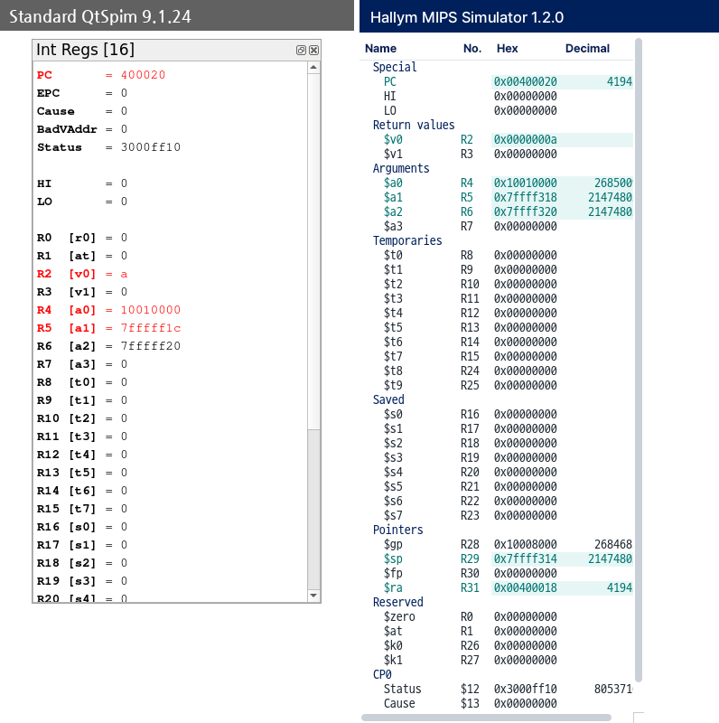
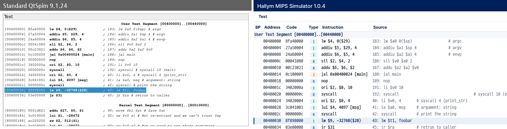
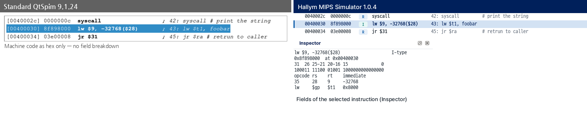
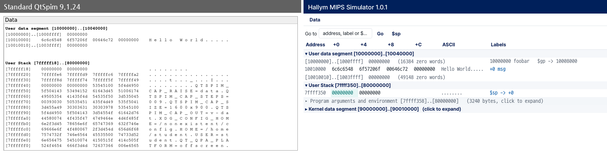
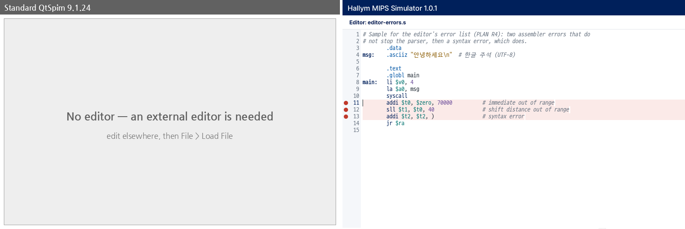

# Hallym MIPS Simulator 1.0.1 — User Guide

Hallym MIPS Simulator is the Hallym University build of the MIPS simulator **QtSpim 9.1.24 with a
new interface only**. The simulator itself (assembler and execution) is the
unmodified original, so **the same program assembles the same way and produces
the same results as in standard QtSpim.** You can check your work in either.

## 1. Installing

1. Unzip `HallymMIPS-<version>-win64.zip` anywhere; unzipping makes one
   folder. (There is an MSI installer too, but the zip is recommended: no
   administrator rights, and removing it is deleting the folder.)
2. Run `HallymMIPS.exe` inside that folder.
3. If "Windows protected your PC" appears, click **More info → Run anyway**. The
   program is not code-signed.

Standard QtSpim may be installed on the same PC. The executable name and the
settings location differ, so neither affects the other.

## 2. The first run: a tutorial of the screen

Every start asks, on the start-up card, whether to **take the tutorial** or to
**start now** -- every time, because a lab machine has a different student in
front of it every hour. Choosing the tutorial opens it. It opens the example
program (`samples/tutorial.s`), runs it into the middle of a function, then
dims the window and lights up one real thing at a time -- a group of tool bar
buttons, the machine word of one instruction, a format badge, a label in the
data panel, the values the function saved on the stack -- saying what it does
and says what it is for and how to use it. Twenty steps: tool bar,
registers, editor, console, text, instruction inspector, data.

- **Next** and **Back** move through it; **Skip** or **Esc** ends it.
- The **EN / 한국어** switch at the top right of the card changes the language.
- The keyboard works too: Enter, Space or the right arrow for the next step,
  the left arrow to go back, Escape to leave.
- To see it again: **Help > Tutorial**. The tutorial **always opens the example**.
  If the editor holds unsaved work it asks about that first, and **Cancel**
  means the tutorial does not start and nothing changes.
- While the tutorial runs the example is **read-only**, and the bases, the memory
  unit and the arrangement are set to their defaults so that what the cards
  say matches what is on the screen. When the tutorial ends your settings come
  back, the example is closed, and the editor shows its start screen.

The example adds up an array in a function, so everything the tutorial points at
is there: a stack frame (`addiu $sp, $sp, -16`, kept 8-byte aligned), a loop
with a branch, `jal`
and `j`, a write back into `.data`, and syscalls. A step whose panel you have
closed is left out and the rest are renumbered.

## 3. The basic loop

1. Write code in the **Editor** tab. (Editor > New / Open; recent files under
   Editor > Open Recent.)
2. **Ctrl+S** saves *and* assembles. F3 and the Assemble tool-bar button do the
   same.
    - On success you are taken to the **Text** tab.
    - On errors you stay in the Editor and the errors are listed below it; click
      one to go to its line. The file has been saved.
3. **F5** runs, **F10** single-steps. Click the BP cell of a Text row to set a
   breakpoint.

An amber strip **"Source changed — save (Ctrl+S) to assemble"** above the Text
and Data tabs means that what you are looking at is not the code in the editor.
Press Ctrl+S or click the strip. You also see it right after starting the
program: the last file is reopened, but nothing is assembled for you.

### Text size

**Ctrl +** and **Ctrl -** change the text size and **Ctrl 0** puts it back
(Ctrl and the wheel work too). Eight to thirty-two points, remembered for
the next time, and the same as Zoom In / Zoom Out / Reset Zoom in the right
click menu. Each panel has its own size -- the keys go to the panel the
mouse or the focus is in, and the editor, Text, Data, the Instruction
Inspector and Console/Messages each remember theirs. To change them all at
once there is "All panels text size" in **Simulator > Settings**.

### Panels wider than they look

Text, Data and Registers all hold more than fits sometimes -- binary
values, memory by the byte, a source line with its comment. The
**horizontal scroll bar** along the bottom fetches the rest.

Scrolled sideways, the **left columns stay where they are**: the name and
number in Registers, Address in Data, BP and Address in Text. You never
end up looking at numbers without knowing which register or which address
they belong to, and the BP cell stays under the mouse however far right
you are, so a breakpoint is always one click away. Stepping, moving the
selection and refreshing the panels leave the sideways position alone.
The tutorial may scroll -- it has to reach what it points at -- but it
puts the position back when it ends.

## 4. What differs from standard QtSpim

In the pictures both programs were given **the same file (helloworld.s), the
same steps and the same window size**: standard QtSpim 9.1.24 on the left,
Hallym MIPS Simulator on the right. The values are the same; only the presentation
differs.

**Registers** — after Run. Grouped by role (Arguments, Temporaries, Saved …),
`$name` and number `R8` together, hex and decimal side by side, what the run
changed on a teal background. Int Regs / FP Regs are **vertical tabs** on the left.

**Text** — columns: BP (click to set a breakpoint) · address · machine code ·
**type badge (R / I / J …)** · instruction · source. Lines that expand to
several instructions (`li`, `la`) are banded; kernel code is one folded row
(click its header).

**Instruction fields** — select an instruction in the Text panel and the
**Instruction Inspector** (bottom right) spreads its word over thirty-two
boxes, one per bit, MSB on the left and LSB on the right, with each field in
its own colour. Under the grid every field gives its bit range, its bits, its
value and what that value means, and a branch or a jump also gets the sum that
produced its destination. What a word of memory holds is in the tool tip of
its cell in the Data panel. Standard QtSpim has nothing like either.

**Data and stack** — address · +0 · +4 · +8 · +C · ASCII · Labels. `.data`
label names, **markers where `$sp` `$fp` `$gp` point**, Words / Half words /
Bytes, Go to (address, label, `$sp`). The **environment area at the top of the
stack is folded**: as the left picture shows, it holds your user name and
folder paths, and this keeps them out of screenshots (click to unfold).

**Editor** — edit inside the program, Ctrl+S saves and assembles. Errors come
as a list, with a red marker on each line, instead of one dialog each.

Also: with a program already loaded, **File > Load File** asks
"**Reinitialize and load / Add to current program / Cancel**" (standard QtSpim
loads on top without asking). An amber status-bar badge shows while a setting
such as Bare Machine is on, and the version is at the right end of the status
bar.

## 5. Good to know

- **Branch offsets differ from the textbook by one.** In its default mode SPIM
  has no delay slots and encodes the offset of `beq`, `bne`, … from the
  **branch's own address (PC)**; textbook MIPS counts from PC+4. The Inspector
  shows the formula it used. Standard QtSpim encodes exactly the same way.
- **Load File is not Reinitialize and Load File.** Load File *adds* to the
  program that is loaded; loading the same file again gives `Label is defined
  for the second time … main`. To reload, use Reinitialize and Load File (or
  Ctrl+S).
- **With Simulator > Settings > Bare Machine on,** pseudo instructions such as
  `li`, `la` and `move` are all syntax errors. The setting survives a restart.
  If the status bar shows an amber "Bare Machine", turn it off.
- Non-ASCII folder names are fine when the Windows system language covers them
  (Korean names on a Korean Windows). Otherwise the simulator cannot open the
  path; the program says so and skips the load. Move the file to an ASCII path.
- A source file is saved in the encoding (UTF-8 or CP949) and with the line
  ends (CRLF / LF) it was opened with.

## 6. Known issues (the same in standard QtSpim)

- A line with a breakpoint looks garbled in the Text log written by **File >
  Save Log File** (`N [x0040002] …`). On screen it is fine.
- Some assembler errors (a constant out of range, for one) are printed in the
  Messages tab with the number of the **following** line. The editor's error
  list and red markers point at the real line.
- Assembling **stops at the first syntax error** in a file; later errors show up
  once it is fixed.

## 7. Window layout

The window is three columns. On the left the registers (**Int Regs** and **FP
Regs** tabs); in the middle the editor with **Console / Messages** under it;
on the right **Text / Data** with the **Instruction Inspector** under that.

- **Console / Messages**: what your program prints (Console) and the
  simulator's own log (Messages) are two tabs of one panel. A syscall that
  waits for input, such as `read_int`, brings the Console tab forward and
  gives it the keyboard; an assembler or run-time error brings Messages
  forward. A message that arrives while you are on the other tab puts a dot
  on it.
- **Folding the panel**: **Ctrl+L** puts the whole Console / Messages panel
  away and brings it back. An error opens it again by itself.
- **Swapping sides**: Window > Layout has two arrangements.
  - **Editor | Text / Data** -- as described above (the initial one).
  - **Text / Data | Editor** -- the columns swap, and the panels below them
    swap with them (Inspector in the middle, Console / Messages on the right).
- You can also drag a tab or a title bar to build your own arrangement; two
  panels dropped side by side share the room evenly. The arrangement is kept
  for the next start, and **Window > Tile** restores the initial one.
- A panel you have closed comes back from the **Window** menu.

Questions and bugs: <https://github.com/ars2323/hallym-mips-simulator/issues>
Developed by Hakhyeon Kim, AIAC Lab, Hallym University. The Hallym University
UI is used under the university's UI guidelines (non-commercial).

SPIM is the work of James R. Larus, distributed under a BSD license. Hallym MIPS
Simulator is a modified version of QtSpim (through QtSpim-Edu) and is not
affiliated with the SPIM project. The bundled fonts Pretendard and D2Coding are
under the SIL Open Font License 1.1 and the Lucide icons under the ISC license
(Help > About > License).
