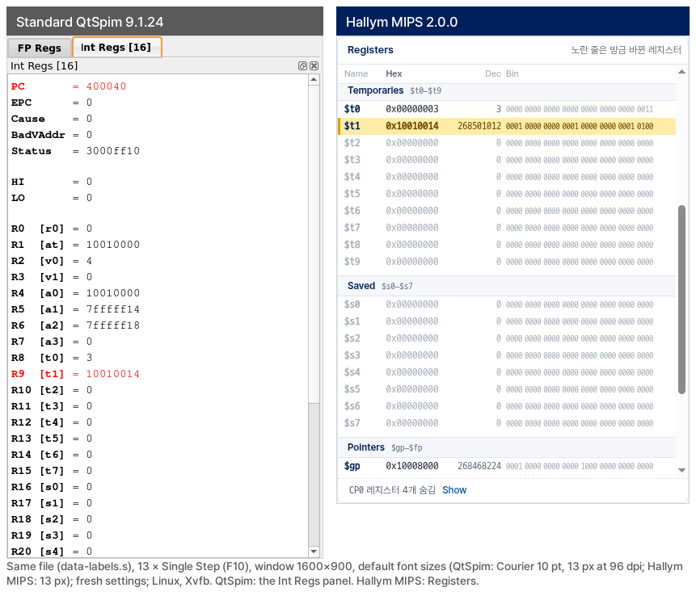
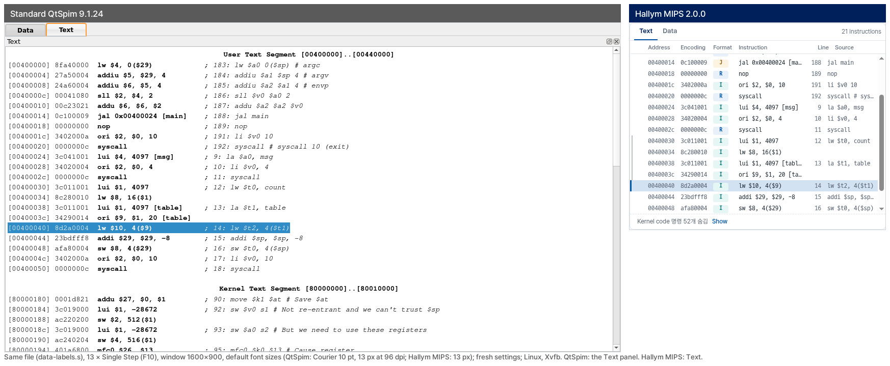
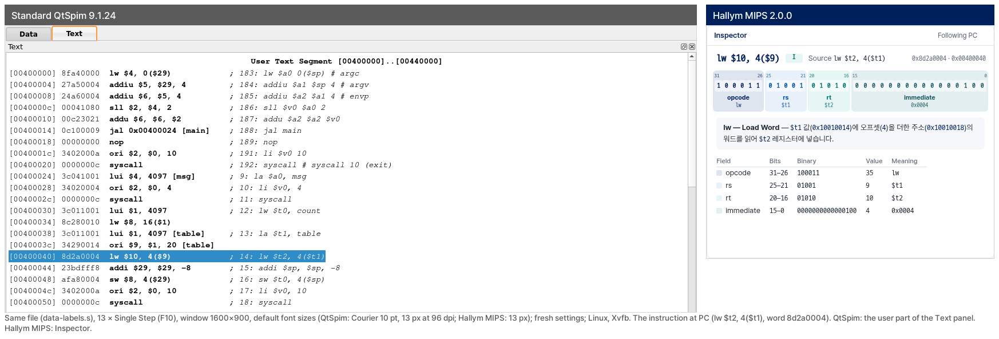
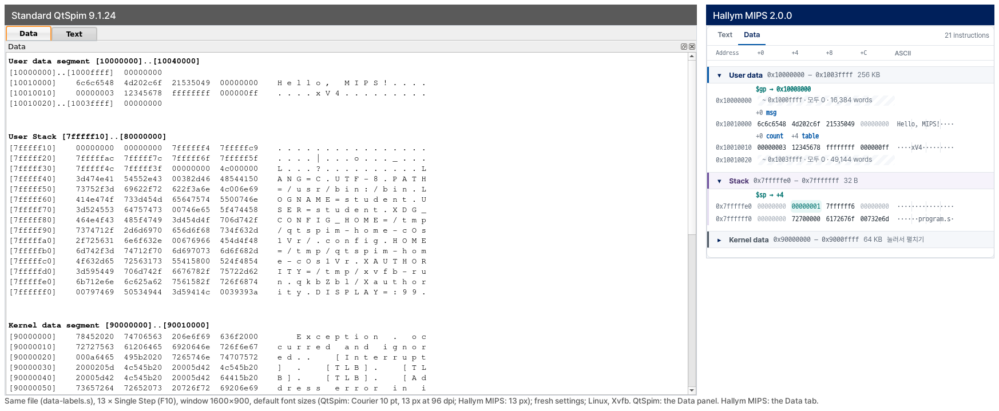
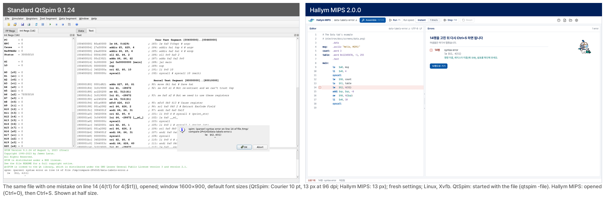
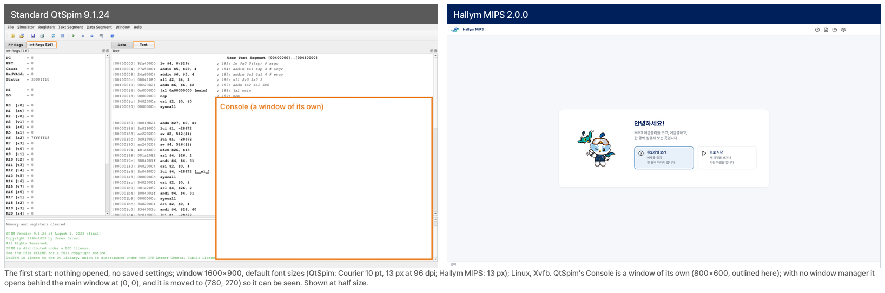

# Hallym MIPS 2.x — 에듀테크 자료

컴퓨터 구조 실습에서 쓰는 MIPS 시뮬레이터를, 시뮬레이션은 그대로 두고 **학생이 보아야 할 것이 화면에
드러나도록** 다시 만든 기록입니다. 무엇이 문제였는지, 무엇을 만들었는지, 그 근거와 숫자, 수업에서 쓰는
방법, 한계를 적습니다.

- 저작: 김학현, AIAC Lab, 한림대학교. 개인 프로젝트이며 한림대학교의 공식 제품이 아닙니다.
- 바탕: [SPIM](https://spimsimulator.sourceforge.net/) — James R. Larus 가 만든 MIPS 시뮬레이터와
  그 Qt 화면인 QtSpim(9.1.24). SPIM 의 저작권 표기는 1990–2023 이고 BSD 라이선스입니다
  ([`CPU/`](../../CPU/), [`README`](../../README)). 이 프로젝트의 시뮬레이션 코어가 바로 그 코드입니다.
- 사용법: [한국어](../usage/usage.ko.md) · [English](../usage/usage.en.md)
- 이 문서의 숫자와 그림은 **v2.0.0 태그** 기준입니다.

---

## 1. 무엇이 문제였나

SPIM 은 30년 넘게(저작권 표기 1990–2023) 쓰여 온 시뮬레이터이고, QtSpim 은 그 화면입니다. MIPS 명령을
정확히 실행하며, 이 프로젝트도 그 코어를 그대로 씁니다. 다만 그 화면은 **시뮬레이터를 쓰는 사람**을 위해
만들어졌습니다. 이 수업의 학생은 처음으로 기계어를
보는 사람이고, 그 학생이 실습에서 보아야 하는 것들이 QtSpim 의 화면에서는 한 걸음씩 떨어져 있었습니다.

- **값은 한 번에 한 진법으로.** 레지스터 창은 16진이나 10진 중 하나로 보입니다(메뉴에서 바꿉니다).
  `li $t0, -1` 뒤의 `ffffffff` 가 −1 이라는 것, 그것이 32개의 1 이라는 것을 한 화면에서 볼 수 없습니다.
- **레지스터는 번호순 목록.** `R0 [r0]` 부터 `R31 [ra]` 까지 한 줄로 이어집니다. 인자, 임시, 보존, 포인터라는
  쓰임새의 묶음은 학생이 외워야 합니다.
- **명령어는 8자리 16진수.** Text 창에 `8d2a0004  lw $10, 4($9)` 처럼 나옵니다. 이것이 opcode 6비트,
  rs 5비트, rt 5비트, 즉시값 16비트라는 것은 학생이 종이에 2진수로 풀어야 보입니다.
- **메모리는 원본 덤프.** `.data` 에 붙인 라벨 이름이 보이지 않고, `$sp` 가 어디를 가리키는지 표시가 없으며,
  스택 맨 위에는 그 컴퓨터의 환경 변수(사용자 이름, 경로)가 들어가 학생마다 스택이 다릅니다.
  문자열은 글자 사이가 벌어져 `H e l l o ,` 로 보입니다.
- **편집기가 없음.** 코드는 메모장 같은 다른 프로그램에서 고치고, 저장하고, QtSpim 에서 다시 불러옵니다.
  어셈블 오류는 대화 상자 한 줄과 메시지 창 한 줄입니다.
- **처음 켰을 때 안내가 없음.** 창이 여러 개(주 창과 Console 창)로 뜨고, 무엇부터 보아야 하는지는
  수업 시간의 설명에 기댑니다.

## 2. 무엇을 만들었나

**시뮬레이션 코어는 원본 그대로 두고, 화면만 새로 만들었습니다.**

- 코어: SPIM 9.1.24 의 [`CPU/`](../../CPU/) 를 **한 줄도 고치지 않고** 씁니다. 이 저장소의
  `tools/regress.sh` 가 `CPU/` 가 원본 태그 `vanilla-9.1.24` 와 바이트 단위로 같은지 확인합니다.
  이 코어를 Windows 데스크톱 앱 안에 넣고, 화면은 수업에 맞춰 새로 그렸습니다. 앱이 코어에 바라는 것
  (실행 중에 멈추기, 입력 받기 같은 것)은 코어의 파일을 고치지 않고 코어 바깥의 감싸는 코드에서 합니다
  ([`CPU/ORIGIN.md`](../../CPU/ORIGIN.md)).
- **같은 프로그램은 같은 결과를 냅니다.** Qt 판(1.x)에서 기록해 둔 기준 결과(골든) 29건 — 레지스터, 메모리,
  메시지 — 을 새 판의 코어가 **29건 모두** 똑같이 냅니다. 테스트를 돌릴 때마다 다시 확인합니다
  ([`electron/tests/golden/`](../../electron/tests/golden/README.md)).
- 일부러 정한 것 하나: 새 판은 모든 프로그램을 **같은 스택**(`argv[0]` 은 `program.s`, 환경 변수 없음)으로
  시작합니다. 그래서 모든 학생이 같은 메모리를 봅니다. 아래 비교 그림에서 `$sp`, `$a1`, `$a2` 와 스택 맨 위가
  QtSpim 과 다른 것은 이 때문이고, 그 밖의 값은 같습니다.
- 이전 판(1.x, Qt 판)은 QtSpim 의 화면을 고쳐 만든 것이었습니다. 2.x 는 그 경험을 이어받아 화면을
  처음부터 다시 만든 판입니다. 1.x 는 [릴리스 1.2.4](https://github.com/ars2323/hallym-mips-simulator/releases/tag/v1.2.4)
  로 남아 있고, 2.x 와 함께 설치할 수 있습니다.

## 3. 근거: 비교 여섯 쌍

README 의 "What's different" 와 **같은 그림**입니다. 그림은 도구 하나가 같은 조건으로 찍습니다.

> **찍은 조건** — 같은 파일([`data-labels.s`](../../electron/tests/samples/data-labels.s)), 같은 실행 단계
> (한 줄 실행 13번: PC 가 14행 `lw $t2, 4($t1)` 에 온 때), 같은 창 크기(1600×900), 각자의 기본 글자 크기
> (QtSpim: Courier 10pt = 96dpi 에서 13px, 2.x: 13px), 저장된 설정 없음, Linux(Xvfb). QtSpim 은
> 원본 태그에서 빌드했고 기본 배치 그대로입니다. 자세한 조건과 원본 그림:
> [`docs/compare/`](../compare/README.md). 도구: `electron/tools/capture-compare.ts`.

### 3-1. Registers

**무엇이 달라졌나.** 레지스터를 쓰임새로 묶었습니다(Temporaries `$t0–$t9`, Saved `$s0–$s7`, Pointers …).
한 행에 16진(Hex), 10진(Dec), 2진(Bin)이 함께 있고, 방금 실행한 명령이 바꾼 레지스터는 노란 줄로 표시되고
화면 안으로 스크롤되어 들어옵니다. QtSpim 도 바뀐 레지스터를 빨간 글씨로 표시하지만, 목록은 번호순이고
진법은 하나입니다.

**학습에 왜 중요한가.** 이 수업에서 레지스터를 보는 이유는 "명령 하나가 무엇을 바꾸는가"를 확인하기
위해서입니다. 바뀐 레지스터가 스크롤 밖에 있으면 학생은 그것을 찾아 목록을 훑어야 하고, 그 사이에
원래 물음을 놓칩니다. 세 진법이 한 행에 있으면 `0xffffffff` 와 −1 과 32개의 1 이 **같은 값**이라는 것,
2의 보수가 무엇인지를 설명 없이 눈으로 확인할 수 있습니다. 쓰임새의 묶음은 호출 규약(인자는 `$a`, 반환값은
`$v`, 호출을 넘어 보존되는 것은 `$s`)을 화면 자체가 가르치게 합니다.

### 3-2. Text

**무엇이 달라졌나.** 어셈블된 명령이 열로 나뉩니다: 주소(Address), 32비트 기계어(Encoding), 형식 배지
(R / I / J), 명령(Instruction), 소스 줄 번호와 소스. PC 가 있는 행이 표시되고, 예외 처리기의 명령 52개는
한 줄로 접혀 있다가 원할 때 펼칩니다. QtSpim 은 같은 정보를 텍스트 한 덩어리로 보여 주고, 커널 코드가
사용자 코드 바로 뒤에 이어집니다.

**학습에 왜 중요한가.** 학생이 가장 먼저 부딪히는 개념 하나가 "소스 한 줄이 기계 명령 여러 개가 된다"는
것입니다(의사 명령). 그림의 13행 `la $t1, table` 은 `lui` 와 `ori` 두 행이 되고, 그 첫 행 옆에 줄 번호 13과
소스가 붙습니다. 열로 나뉘어 있으면 그 대응을 줄 번호 열 하나로 따라갈 수 있습니다. 형식 배지는 명령마다
R / I / J 중 무엇인지를 매번 보여 주어, 다음 절의 비트 필드 설명과 이어집니다. 학생이 쓴 코드가 아닌
커널 코드를 접어 두면 화면의 대부분이 학생의 프로그램이 됩니다.

### 3-3. Inspector

**무엇이 달라졌나.** 지금 실행할 명령(또는 Text 에서 누른 명령)을 32칸의 비트로 펼칩니다. 필드마다 색과
이름(opcode, rs, rt, immediate …)이 있고, 필드별로 비트 범위, 2진수, 값, 뜻이 표로 나옵니다. 그 아래에는
지금 레지스터 값을 넣은 한 문장이 붙습니다 — 그림에서는 "`$t1` 값(`0x10010014`)에 오프셋(4)을 더한
주소(`0x10010018`)의 워드를 읽어 `$t2` 레지스터에 넣습니다". QtSpim 에서 같은 명령은 Text 창의
`8d2a0004` 입니다.

**학습에 왜 중요한가.** 명령어 형식은 이 수업의 중심 내용인데, 16진수 8자리에서 필드를 읽으려면
학생이 32비트 2진수로 바꾸고 경계를 세어야 합니다. 그 계산은 한두 번은 연습이 되지만, 실습 내내
반복되면 명령이 무엇을 하는지 보는 일을 가립니다. Inspector 는 그 풀이를 화면이 대신 보여 주고,
학생은 "rs 가 9 이니 `$t1`", "즉시값 4 가 오프셋" 처럼 필드와 뜻을 잇는 일에 집중할 수 있습니다.
Text 의 Encoding 값과 비트 칸이 같은 수라는 것도 한 화면에서 확인됩니다(튜토리얼 9단계).

### 3-4. Data

**무엇이 달라졌나.** 메모리가 표로 나옵니다: 한 행에 주소와 4바이트 워드 넷. `.data` 에 붙인 라벨
(`msg`, `count`, `table`)이 그 워드 위에 붙고, `$gp` 와 `$sp` 가 가리키는 곳이 표시됩니다. 0 만 이어진
구간은 "모두 0 · 16,384 words" 처럼 한 줄로 줄입니다. ASCII 열은 같은 바이트를 글자로 보여 주어,
`Hello, MIPS!` 가 한 낱말로 읽힙니다. 스택은 모든 학생에게 같습니다(2절).

**학습에 왜 중요한가.** 학생이 Data 영역에서 확인하려는 것은 "내가 `.data` 에 쓴 것이 메모리의 어디에,
어떤 바이트로 놓였나"입니다. 라벨이 주소 위에 붙어 있으면 `la $t1, table` 이 만든 주소와 그 자리의 값을
바로 맞춰 볼 수 있습니다. 문자열이 낱말로 읽히면 `.asciiz` 가 바이트의 나열이라는 것, 한 워드에 글자
넷이 거꾸로(리틀 엔디언) 들어간다는 것을 16진 열과 나란히 보며 이해할 수 있습니다. `$sp` 표시는 스택이
아래로 자란다는 것을 `sw` 한 번에 눈으로 확인하게 합니다(튜토리얼 12–13단계). 환경 변수가 없는 같은
스택은, 학생 둘이 화면을 비교할 때 같은 주소에 같은 값이 있게 합니다.

### 3-5. Editor 와 오류

**무엇이 달라졌나.** 창 안에 편집기가 있습니다. Ctrl+S 한 번이 저장과 어셈블입니다. 오류가 나면
Run 쪽에 Errors 패널이 나와, 맨 위에 무엇을 하면 되는지("14행을 고친 뒤 다시 Ctrl+S 하면 됩니다"),
그 아래 오류와 고치는 요령, **14행으로 가기** 버튼이 있고, 편집기의 그 줄에도 표시가 붙습니다.
QtSpim 에는 편집기가 없어서, 같은 실수는 "syntax error on line 14" 대화 상자와 메시지 창의 한 줄로
나옵니다. 고치려면 다른 편집기로 가서 14행을 찾아야 합니다.

**학습에 왜 중요한가.** 실습 시간의 많은 부분은 "고치고 다시 해 보기"의 반복입니다. 편집기와 시뮬레이터
사이를 오갈 때마다 저장, 다시 불러오기, 초기화를 빠뜨리면 학생은 **고치기 전의 코드**를 실행하게 되고,
그것은 코드의 오류와 구별되지 않는 혼란을 낳습니다. 새 판은 코드를 고치면 Run 쪽에 "코드가 바뀌었습니다"를
띄워, 지금 기계에 있는 것이 어느 코드인지 늘 알 수 있게 합니다. 오류 메시지에 고치는 요령이 붙어 있으면
("명령 이름, 레지스터 이름(예: `$t0`), 쉼표를 확인해 보세요") 학생이 오류 문장을 스스로 읽는 연습이 됩니다.

### 3-6. 처음 켰을 때

**무엇이 달라졌나.** 새 판은 시작 화면에서 두 가지를 묻습니다: **튜토리얼 보기**와 **바로 시작**.
튜토리얼은 예제 프로그램을 열어 두고 **실제 화면**의 한 곳씩을 가리키는 20단계입니다: Editor, Assemble,
Registers, 소스 한 줄이 두 명령이 되는 곳, 한 줄 실행, 방금 바뀐 레지스터, 세 진법, Inspector 의 32비트,
Data 탭, 라벨, `sw`, 스택, 브레이크포인트, Run, 천천히 실행, Reset, Console, 오류, 마무리.
"직접 해 보세요" 단계는 학생이 말한 대로 하면(예: F10) 넘어갑니다. QtSpim 은 주 창과 Console 창(그림에서
주황 테두리)을 띄우고, 무엇부터 할지는 정해 두지 않습니다.

**학습에 왜 중요한가.** 첫 실습 시간에 도구의 사용법을 설명하는 데 드는 시간은, 그 시간에 다루려던
내용에서 빠집니다. 튜토리얼은 그 설명을 학생 각자의 속도로 옮기고, 설명이 가리키는 곳이 그림이 아니라
지금 보는 화면이라 "어디를 말하는 것인지" 헤매지 않게 합니다. 튜토리얼은 언제든 물음표(?) 버튼으로
다시 볼 수 있습니다. 튜토리얼이 학습에 주는 효과는 측정한 적이 없습니다(6절).

## 4. 숫자

저장소에서 확인되는 것만 적습니다. 모두 **v2.0.0 태그** 기준이고, 각 숫자 옆에 확인한 방법을 적습니다.

| 항목 | 값 | 어디서 |
|---|---|---|
| 고치지 않은 SPIM 코어 | 11,221줄 | `wc -l CPU/*.cpp CPU/*.h CPU/*.y CPU/*.l` (합계). 원본과 같음: `tools/regress.sh` 1번 검사 |
| Qt 판에서 옮긴 코어 모듈 | 6개, 990줄 | `electron/src/core/` 의 decoder 468 · registers 141 · format 79 · instruction-text 196 · source-text 26 · symbols 80 (`wc -l`). 목록: `electron/docs/DEVELOPMENT.md` |
| 같은 결과 확인(나란히 검사) | 29건 중 29건 통과 | Qt 판의 골든과 비교: `electron/tests/golden/qt.test.ts`, 설명 `electron/tests/golden/README.md` |
| 기본 설정 골든 | 17건 중 17건 통과 | `electron/tests/golden/default.test.ts` |
| 단위·골든 테스트 | 184개 | `cd electron && npm test` 의 `# tests 184` |
| 실제 앱 테스트(e2e) | 66개 × 화면 폭 4가지 | `npx playwright test --list` 는 68개(그중 2개는 실제 한국어 IME 용, Windows CI 에서만) · `node tools/e2e-widths.ts` |
| 한글 입력 검사 | 12개 | `electron/tests/e2e/ime.e2e.ts` |
| 돌연변이 검사 | 118개, 모두 잡힘 | `node tools/mutants.ts` (일부러 틀리게 고친 코드를 테스트가 잡는지) |
| 튜토리얼 | 20단계 | `electron/src/renderer/app/tutorial.ts` 의 `STEPS` |
| 지원 화면 폭 | 4가지 | 1280×800 · 1366×768 을 125% 로(1093×582) · 1024×768 · 1366×768 을 150% 로(910×505): `electron/tools/e2e-widths.ts` |
| 비교 그림 | 6쌍 | [`docs/compare/`](../compare/README.md) |

## 5. 수업에서 어떻게 쓰나

**설치.** [릴리스 페이지](https://github.com/ars2323/hallym-mips-simulator/releases/latest)에서 설치 파일이나
zip 을 받습니다. 관리자 권한은 필요 없습니다. 코드 서명이 없어 처음 실행할 때 Windows 경고가 뜨는데,
넘기는 방법은 [사용법의 해당 절](../usage/usage.ko.md#windows-경고-창-넘기기)에 글로 자세히 있습니다.
이전 판(1.x)이 깔린 실습실 PC 에도 그대로 옆에 설치되고, 서로 건드리지 않습니다.

**공용 PC.** 프로그램은 **아무것도 기억하지 않습니다.** 글자 크기, Data 진법, 창 크기, 열었던 파일, 튜토리얼
진행이 모두 실행이 끝나면 처음으로 돌아가므로, 앞 학생이 바꾼 화면을 다음 학생이 물려받지 않습니다.
남는 것은 학생이 직접 저장한 `.s` 파일뿐입니다.

**첫 시간.** 시작 화면에서 **튜토리얼 보기**. 20단계를 따라가면 화면의 모든 부분을 한 번씩 거칩니다.
각 단계는 실제로 해 보는 단계와 읽는 단계로 나뉘고, 막히면 **건너뛰기**가 나타나 튜토리얼이 대신 해 줍니다.

**실습 흐름.**
1. 과제 파일을 열거나(Ctrl+O) 새 파일에 씁니다.
2. **Ctrl+S** — 저장과 어셈블. 오류가 나면 Errors 패널의 첫 문장과 **N행으로 가기**.
3. **F10** 으로 한 줄씩 — 노란 줄(바뀐 레지스터), Inspector(명령의 비트), Data 탭(메모리).
4. 반복문이나 함수는 **브레이크포인트**(줄 번호 왼쪽을 누름)와 **F5**. **1 line/s** 로 천천히 볼 수도 있습니다.
5. 다시 하려면 **Reset**.

**문제가 생기면.** 2.x 가 실습실에서 문제를 일으키면 1.x(릴리스 1.2.4)로 돌아갈 수 있습니다. 1.x 는 같은
코어를 쓰므로 같은 프로그램은 같은 결과를 냅니다.

## 6. 한계와 앞으로

- **코드 서명이 없습니다.** 처음 실행할 때 Windows SmartScreen 이 경고합니다. 사용법 문서가 넘기는 방법을
  안내하지만, 학생에게는 한 단계가 더 있는 셈입니다.
- **Windows 용만 배포합니다.** 개발과 테스트는 Linux 에서도 하지만, 배포본은 Windows 64비트뿐입니다.
- **한글 입력.** 조합 중 Enter · Tab · 백스페이스 · Ctrl+S · 다른 곳 클릭, 줄 끝의 한글, 한글 주석 파일,
  UTF-8 왕복, Console 입력을 브라우저 엔진의 입력기 경로(IME 이벤트)로 검사합니다(12개). 실제 한국어 Windows
  의 입력기로 한 검사 결과는 `electron/docs/PORTING.md` 에 적습니다.
- **미해결 목록.** 검토에서 나왔지만 아직 고치지 않은 것은
  [`electron/docs/screens/README.md` 의 Open issues](../../electron/docs/screens/README.md#open-issues)에 있습니다.
  지금은 하나입니다: 창 폭 971–1034px 에서 Data 탭이 옆으로 최대 10px 넘칩니다.
- **효과는 측정하지 않았습니다.** 이 문서의 "학습에 왜 중요한가"는 화면이 무엇을 보여 주는지에서 나온
  설명이고, 성적이나 만족도 같은 효과를 잰 결과가 아닙니다. 효과를 말하려면 수업에서 따로 재야 합니다.

## 출처

- SPIM / QtSpim: James R. Larus, <https://spimsimulator.sourceforge.net/>, 원본 코드
  <https://sourceforge.net/p/spimsimulator/code/>. 이 저장소의 `CPU/` 는 그 9.1.24 판(SVN r764)이며,
  출처와 확인 방법은 [`CPU/ORIGIN.md`](../../CPU/ORIGIN.md) 에 있습니다.
- 한림대학교의 표장과 캐릭터(하람, 하리)는 한림대학교의 것이며 이 프로젝트의 라이선스가 적용되지 않습니다
  ([`NOTICE`](../../NOTICE)).
