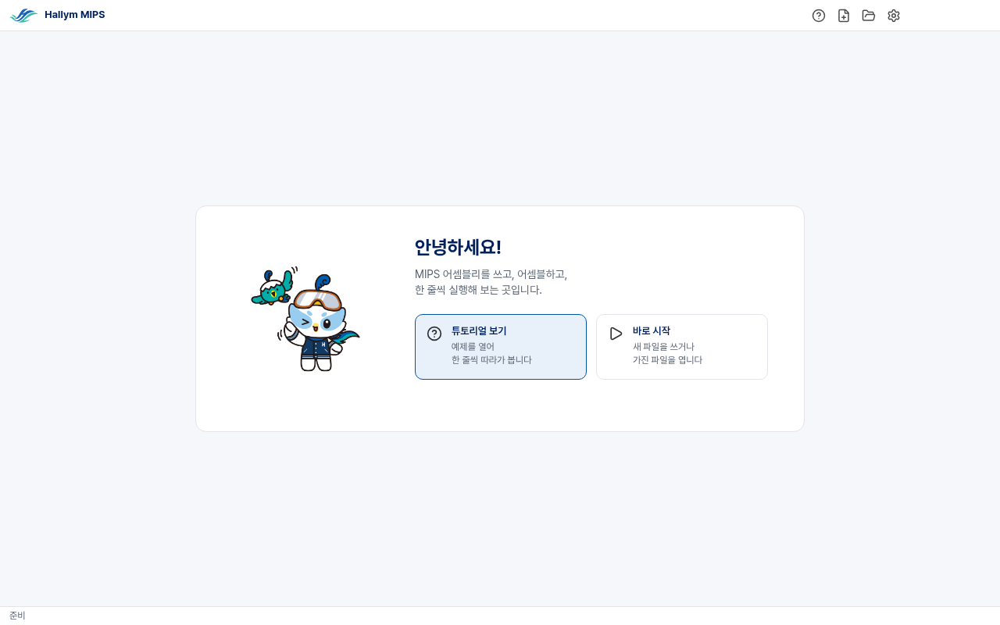
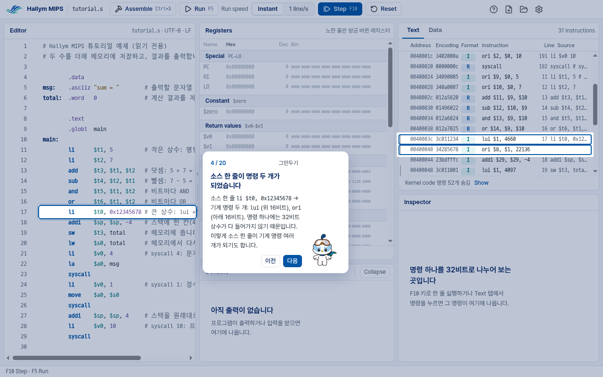
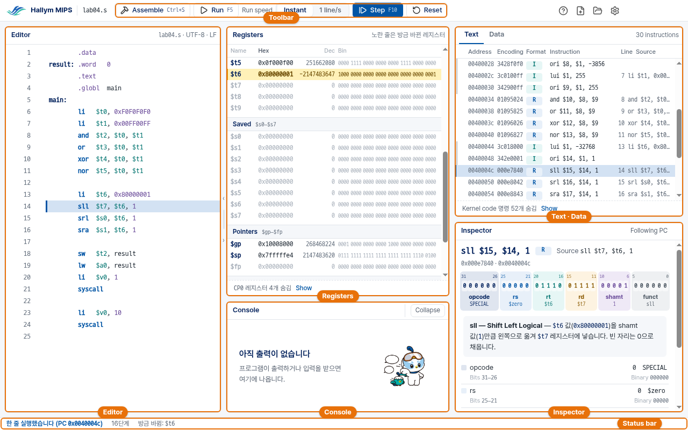

# Hallym MIPS user guide (2.x)

[한국어](usage.ko.md)

Hallym MIPS is the MIPS simulator used in the computer architecture courses of
Hallym University. You write MIPS assembly, assemble it, and run it one line at
a time, watching registers, memory and each instruction's 32 bits change. This
guide is for 2.x, the current version.

**If this is your first time, read sections 1, 2 and 3 in order.** Many
students get stuck at section 2, the Windows warning.

1. [Download](#download)
2. [Getting past the Windows warning](#getting-past-the-windows-warning) ← read this
3. [Installing and starting](#installing-and-starting)
4. [The first time: the start screen and the tutorial](#the-first-time-the-start-screen-and-the-tutorial)
5. [A tour of the window](#a-tour-of-the-window)
6. [Your first program](#your-first-program)
7. [Where students get stuck](#where-students-get-stuck)
8. [Keys](#keys)
9. [The previous version (1.x)](#the-previous-version-1x)

The program's screens use English names (Editor, Registers, Assemble …) and
speak to you in Korean; this guide quotes the Korean where you will see it.

---

## Download

From the [release page](https://github.com/ars2323/hallym-mips-simulator/releases/latest),
download **one file**, `HallymMIPS-<version>-win-x64-setup.exe`. It is the
installer, for 64-bit Windows.

- No administrator rights are needed; it installs for the signed-in user only,
  and adds a Start menu entry.
- If the previous version (1.x, "Hallym MIPS Simulator") is installed, it stays
  as it is: 2.x installs beside it, and neither touches the other.

### When the browser blocks the download

Edge or Chrome may warn that the file *"isn't commonly downloaded"*: a warning
given to files that few people have downloaded yet.

- **Edge:** when the download ends, the download list opens at the top right
  with a warning under the file's name. Move the pointer onto that line and a
  **…** button appears at its right end. **…** → **Keep** opens a small window:
  open **Show more** there and choose **Keep anyway**. The file then stays in
  your Downloads folder.
- **Chrome:** on the file's line in the download list, **Keep** (or
  **Download anyway**).

---

## Getting past the Windows warning

The program is not code-signed, so **Windows always warns the first time you
run it.** A blue window opens in the middle of the screen. At its top, in large
letters, it says **"Windows protected your PC"** (Korean Windows:
**"Windows의 PC 보호"**); the text under it, two or three lines, says that
Microsoft Defender SmartScreen prevented an unrecognized app from starting.
At this point there is only one button, at the bottom right:
**"Don't run"** (*"실행 안 함"*).
**If you press Don't run, the program does not open.** Instead:

1. Just below the text, on the left, there is an underlined link,
   **"More info"** (*"추가 정보"*). Click it.
2. The window changes. Two lines appear under the text:
   - **App:** `HallymMIPS-…-setup.exe`
   - **Publisher:** Unknown publisher

   and the buttons at the bottom right go **from one to two**: **"Run anyway"**
   (*"실행"*) on the left, **"Don't run"** (*"실행 안 함"*) on the right.
   Click **Run anyway**, the left one.
3. The installer then installs (next section).

"Unknown publisher" is what an unsigned program gets. If the file name on the
App line is the file you just downloaded, it is safe to run.

The warning comes **once, the first time that file is run.** Opening the
installed program from the Start menu later does not show it again.

### If it still does not open

- **A window without a Run button** — *"This app has been blocked"*, *"Your
  administrator has blocked this app"*: the PC's management policy stops it,
  and a student cannot get past it. In a lab, tell the teaching assistant or
  the person in charge. On your own PC, look at your antivirus program's
  block history.
- If an antivirus program deleted the file, download it again and add it to
  the antivirus program's exceptions.

---

## Installing and starting

1. Run the downloaded `HallymMIPS-<version>-win-x64-setup.exe` (for the
   warning, see [the previous section](#getting-past-the-windows-warning)).
2. It installs straight away, asking nothing; when the progress window
   closes, it is done. The program does not open by itself.
3. Open it from **Start menu → Hallym MIPS**. (No desktop shortcut is made.)

It is installed in `%LOCALAPPDATA%\Programs\Hallym MIPS`. For a new version,
just install again: it goes over the old one in the same place.

**Removing it:** Settings → Apps → Installed apps → *Hallym MIPS 2.x.x* → Uninstall.

### What the program remembers

**Nothing.** Lab PCs are shared, so the program starts on the same screen
whoever opens it.

- While it runs you can change things: the **font size** and the **Data
  radix** in the settings (the gear button), the Advanced options, the font
  size with Ctrl + = / Ctrl + −, folded panels, the window's size.
- When you close it, all of them go back to where they started. So do the
  files you opened and where you were in the tutorial.
- While it runs it keeps the temporary files it needs for drawing the window
  in `%TEMP%\HallymMIPS\`, and removes them when it closes. What a sudden
  shutdown leaves there is removed the next time it starts.
- What stays is only the **`.s` files you save yourself.**

---

## The first time: the start screen and the tutorial

The program opens on a start screen where Haram, the university's character,
says hello. There are two choices:

- **튜토리얼 보기** (see the tutorial) — for your first time. Twenty steps point
  at one part of the window after another.
- **바로 시작** (start right away) — then **새 파일** (new file) or **파일 열기**
  (open a file, Ctrl+O).



### The twenty-step tutorial

The tutorial opens an example program (`tutorial.s`) and points at the real
window, one place at a time: what it points at is outlined in blue, the rest
lightly dimmed.

| Steps | What you learn |
|---|---|
| 1–4 | Editor, Assemble, Registers, Text — one line of source can become several machine instructions |
| 5–9 | Running one line (Step), the register that just changed, hex, decimal and binary, the Inspector's 32 bits |
| 10–13 | The Data tab, labels, memory changed by `sw`, the stack |
| 14–17 | Breakpoints, Run, running slowly (1 line/s), Reset |
| 18–20 | Output in the Console, what to do when assembly fails, the end |

- Explanation steps go on with **다음** (next), or the → key.
- A step that says **"직접 해 보세요"** (try it yourself) asks you to do
  something (press F10, for example). Once you have, the card points at the
  result (the register that changed, the value in memory, the Console's
  output …) and waits; **다음** (next) goes on. If it does not work, press
  **건너뛰기** (skip), which appears after a few seconds: the tutorial does it for you.
- **이전** (back, the ← key) goes back a step; **그만두기** (stop, the Esc key)
  ends the tutorial at any time.
- The example is **read-only**. When the tutorial ends, the example closes and
  you are back where you were before it (your own file, if one was open; if it
  had unsaved changes, the tutorial asks first).
- Your progress is not saved: after the program is closed and opened again, the
  tutorial starts from step 1.
- The **question mark (?) button** at the top right brings it back any time.



This is step 4. It points at one `li` line in the Editor and at the two rows
it became in the Text panel (`lui`, `ori`), together.

---

## A tour of the window

With a file open, the **Editor** is on the left and the **Run** side on the right.



| Name | What |
|---|---|
| **Toolbar** | **Assemble** (Ctrl+S) · **Run** (F5; **Stop** while running) · **Run speed** (Instant / 1 line/s) · **Step** (F10) · **Reset**. At the right: the tutorial (?) · new file · open file · settings |
| **Editor** | Where you write assembly. Clicking the column left of the line numbers sets a **breakpoint** (a red dot). While a program runs, the line about to run has a **blue band** |
| **Registers** | The 32 registers and PC, HI, LO, grouped by use (Arguments, Temporaries, Saved …). The register that just changed is a **yellow row**. **Hex** · **Dec** · **Bin** are the same value in hexadecimal, decimal and binary |
| **Text** | The assembled machine instructions: **Address** · **Encoding** (the 32 bits in hex) · **Format** (R/I/J) · **Instruction**. A source line that became several instructions has several rows. Clicking a row shows that instruction in the Inspector |
| **Data** | The tab next to Text. Memory (what you wrote in `.data`, the stack) in 4-byte words, four to a row; label names above their addresses, and where `$sp` and `$gp` point. A run of zero words is one line. The **ASCII** column shows the same bytes as characters (in a narrow window it is turned on with **+ ASCII**) |
| **Inspector** | One instruction taken apart into its 32 bits: opcode · rs · rt · rd … in colours per field, each field's value and meaning, and one sentence (in Korean) saying what the instruction does |
| **Console** | Your program's output (syscalls). A syscall that reads input shows an input field here |
| **Errors** | Shown on the Run side when assembly fails: first what to do, then the errors with a hint for each, and a **N행으로 가기** (go to line N) button |
| **Status bar** | At the bottom: what just happened (e.g. *한 줄 실행했습니다*, one line run; *브레이크포인트에서 멈췄습니다*, stopped at a breakpoint), the step count, the register that just changed |

In a narrow window (a laptop with a large display scale, for example), the
Editor and the Run side are shown one at a time; switch with the **Editor | Run**
tabs in the top bar. A column hidden for lack of width comes back with a button
in the panel's head, such as **+ Bin** or **+ Source**.

---

## Your first program

1. Press **new file** (on the start screen *바로 시작 → 새 파일*, or the button at
   the top right) and type:

   ```asm
           .data
   msg:    .asciiz "hello\n"
           .text
   main:   li      $t0, 5
           li      $t1, 7
           add     $t2, $t0, $t1   # $t2 = 12
           li      $v0, 4          # print a string
           la      $a0, msg
           syscall
           li      $v0, 10         # exit
           syscall
   ```

   An existing file opens with **open file** (Ctrl+O).

2. Press **Ctrl+S**: it saves and assembles in one go (the first time, it asks
   where to save). When it succeeds, Registers, Text, the Inspector and the
   Console appear on the right; when it fails, **Errors** does
   ([where students get stuck](#where-students-get-stuck)).
3. Each **F10** (Step) runs one line. The blue band in the Editor is the line
   about to run; the yellow row in Registers is the register that just changed.
   After the `add`, `$t2` is 12 (`0x0000000c`). For the first few presses there
   may be no blue band: the start-up code that runs before your program is
   running.
4. **F5** (Run) runs to the end. `hello` appears in the Console, and the status
   bar says *프로그램이 끝났습니다* (the program has finished).
5. **Reset** starts again from the beginning.

If you change the code, the Run side says *코드가 바뀌었습니다* (the code has
changed): press **Ctrl+S** again to assemble the new code.

---

## Where students get stuck

**The program does not open / a blue warning appears** — see
[getting past the Windows warning](#getting-past-the-windows-warning).

**It does not assemble** — the first sentence in **Errors**, on the right, says
what to do; **N행으로 가기** takes you to the line, which has a `!` beside it in
the Editor. Common causes: a misspelt instruction (`srll` → `srl`), a register
without its `$` (`t0` → `$t0`), a missing comma.

**F5 was pressed and it does not end** — the program loops forever (check the
loop's condition), or it is waiting for input.
- **Esc** or **Stop** stops it; you can then look at the registers and memory
  where it stopped.
- If the Console shows an input field, type a value and press **Enter**.

**F10 is pressed and the Editor's blue band does not move** — the start-up code
(`__start`, a few lines that run before your program) is running. A few more
presses and you are at the first line of `main`.

**A breakpoint does not stop the program / cannot be set** — lines without an
instruction (empty lines, comments, a label alone) cannot have one: set it on a
line with an instruction. A breakpoint set before assembling takes effect at
the next assemble (Ctrl+S); one set after assembling takes effect at once.

**The right side is empty / *아직 어셈블하지 않았습니다* (not assembled yet)** —
press **Ctrl+S** (or **Assemble**).

**코드가 바뀌었습니다 (the code has changed)** — you edited the code after
assembling it; **Ctrl+S** assembles it again.

**The binary (Bin) or Encoding column is missing** — the window is too narrow
for it. Widen the window, or press **+ Bin** / **+ Encoding** in the panel's head.

**The text is too small or too large** — **Ctrl + =** / **Ctrl + −**, or the
font size in settings (the gear). Either lasts for this run only: the next
start is at the usual size ([What the program remembers](#what-the-program-remembers)).

**Korean comments or Korean file names** — fine. Files are saved in their own
encoding (UTF-8, or CP949 for older files).

**Which version is this?** — Settings (the gear) → **About · Licenses** shows
the version. 2.x is "Hallym MIPS"; 1.x is "Hallym MIPS Simulator".

---

## Keys

| Key | What it does |
|---|---|
| Ctrl+S | Save and assemble |
| F10 | Run one line (Step) |
| F5 | Run / go on from a breakpoint |
| Esc | Stop a run |
| Ctrl+O | Open a file |
| Ctrl + = / Ctrl + − / Ctrl + 0 | Larger / smaller / normal text (this run only) |
| Tab / Shift+Tab | Indent / outdent by four columns in the Editor |

---

## The previous version (1.x)

1.x (the Qt edition, "Hallym MIPS Simulator") is the previous version. If you
need it, it is at [release 1.2.4](https://github.com/ars2323/hallym-mips-simulator/releases/tag/v1.2.4),
and its guide is the [1.x user guide](../GUIDE.md). It can be installed
alongside 2.x.
